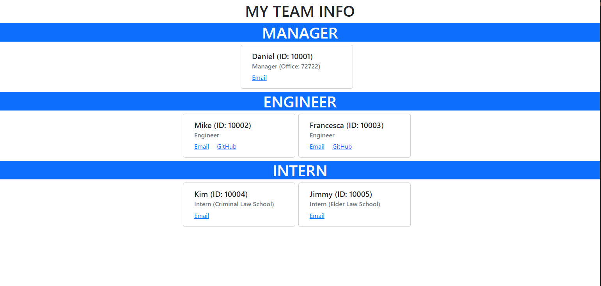
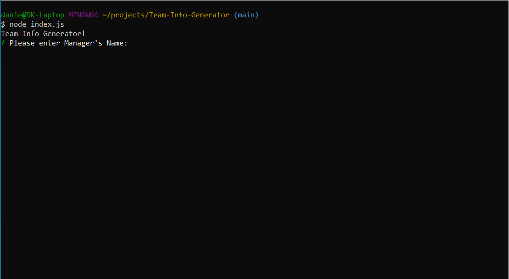

# Team Info Generator

  [](https://opensource.org/licenses/MIT)

  ## Description

  The Team Info Generator application uses the Command line interface to get information and creates an HTML file. If you need a quick and cool minimalistic style HTML file with your team's contact info, this application can produce that. Considering any future projects, I wanted to remove any tedious actions in contacting my team members. This application provides links to team member's email and other information such as Github profiles. The generated HTML file displays a simple, minimalistic webpage and also displays all the necessary information such as the position, employee ID, and more. This makes getting in touch with teammates quick and easy.

  

  ## Table of Contents

  - [Installation](#installation)
  - [Usage](#usage)
  - [Contributing](#contributing)
  - [Tests](#tests)
  - [Questions](#questions)
  - [License](#license)

  ## Installation

  Assumming you have the files and opened them with your preferred coding editor you will need to install the necessary dependencies for this generater to work first. In Bash or Terminal, simply type:
  ```
  $ npm install
  ```
  This will install all the dependencies in the `Package.json` file, which are [`Inquirer`](https://www.npmjs.com/package//inquirer) and [`Jest`](https://jestjs.io/). 

  ## Usage

  In the bash or terminal, go to the files for the generator. Once you are in the files, type the following in the terminal:
  ```
  $ node index.js
  ```
  This will display a series of prompts for you to answer to display in the HTML file. 

  

  ## Contributing

  If you would like to contribute, make sure to do a pull request before merging it with main. DO NOT MERGE WITH MAIN without letting me know 😃.

  ## Tests 

  A `sample.txt` is in the root directory folder for testing. Here is a walkthrough of the application. 


  https://user-images.githubusercontent.com/103972201/181407131-26156d5f-4401-495f-89ec-f740d90f3604.mp4
  
  CREDITS to Clideo.com for help reducing video file size.

  ## Questions

  GitHub profile: [https://github.com/DKhubgit](https://github.com/DKhubgit)

  Email me at - danielkang13@gmail.com - if you have questions!

  ## License

  Copyright (c) 2022 , DKhubgit
  
  All rights reserved.

  Licensed under the [MIT license](https://opensource.org/licenses/MIT) License.
